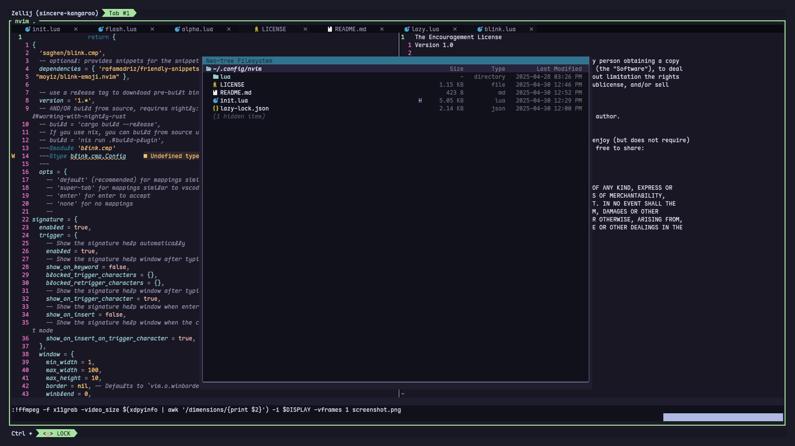
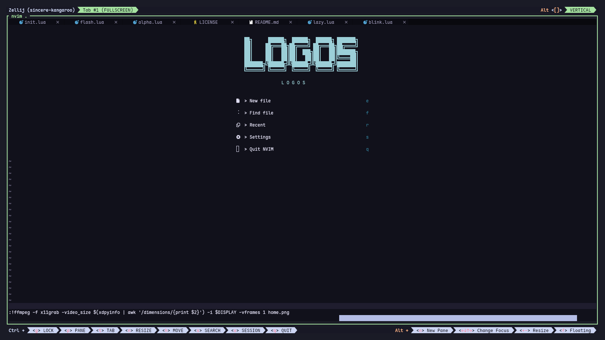

# Neovim from scratch 🚀
 
I sat down and thought that I should make a plugin but I hardly understood the neovim apis
I decided to try and build neovim from scratch whilst not trying to emulate lazyvim

It is a powerful learning experience that guided me to understand part of the lua api which I consider kinda complicated(skill issue).


## Installation 
```
git clone git@github.com:Mtendekuyokwa19/dotneovim.git

``` 

 
